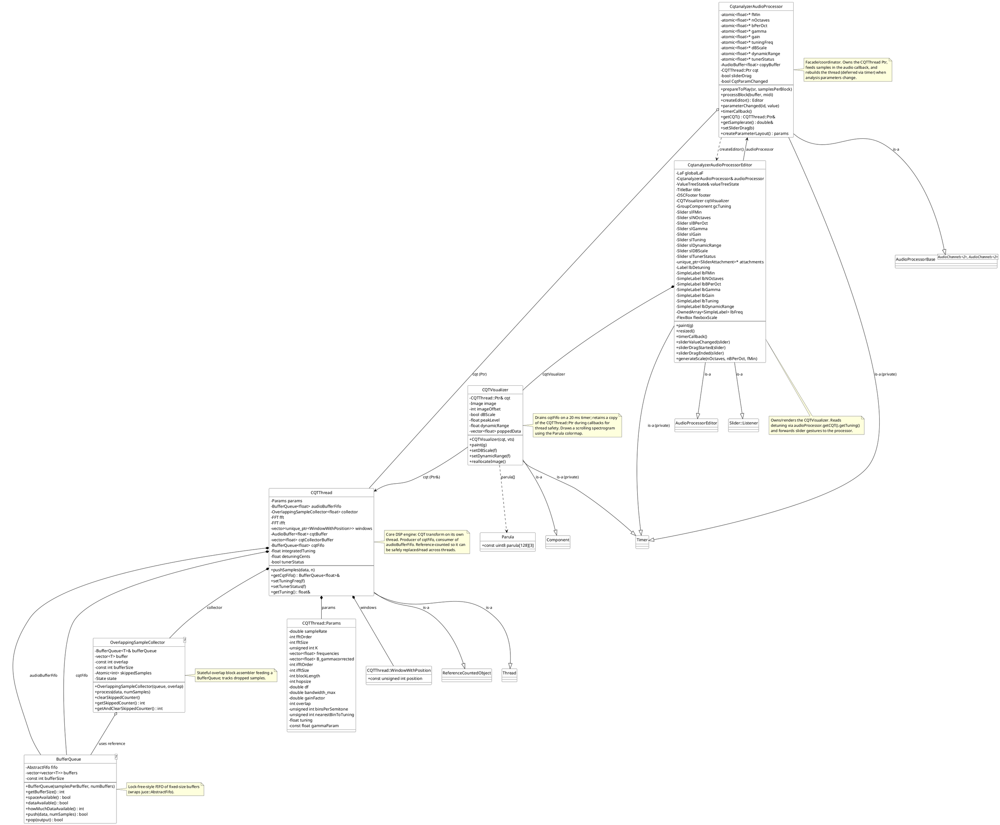

# CQT Analyzer — Plugin Architecture Summary

This document explains the architecture of the **CQT Analyzer** JUCE audio plugin (part of the
IEM plug-in suite). It implements a **Constant-Q Transform (CQT) spectrogram analyzer** with a
built-in auto-tuner. The architecture follows the classic JUCE layering:

`AudioProcessor` (host-facing, audio thread) -> dedicated DSP worker `CQTThread` (analysis
thread) -> `CQTVisualizer` (UI component reading threaded results) -> `AudioProcessorEditor`
(UI layout).

All classes described below are defined in the `Source` folder.

---

## The data-flow pipeline at a glance

```
 Host audio thread                         Background analysis thread          GUI (message thread)
+---------------------+                  +--------------------------------+   +-------------------+
| AudioProcessor      |  pushSamples     | CQTThread:                     |   | CQTVisualizer    |
|  - processBlock     | --->            |   collector -> audioBufferFifo  |   |  - timerCallback |
|  - mixes 2ch->mono  |                 |   FFT -> per-bin IFFT -> cqt    |   |  - updateData    |
+---------------------+                 |   cqtFifo (results queue)       |   |  - paint         |
        ^  owns Ptr (ref-counted)       +--------------------+------------+   +-------------------+
        |                                     ^       | getCqtFifo()              ^
        |                                     |       v                          |  holds Ptr&
   [CQTThread::Ptr]  <--------------  buffers[K][ifftSize]                   AudioProcessorEditor
        |                                     |                                      |
        +--> getCQT()/getTuning() <-----------+                 owns/renders         |
```

---

## Per-class explanation

### 1. `BufferQueue<SampleType>` — `Source/Utilities/BufferQueue.h`

A **generic, lock-free-style FIFO of fixed-size sample buffers**, used wherever threaded data
must be transferred. It wraps a JUCE `juce::AbstractFifo` indexing `numBuffers` pre-allocated
`std::vector<SampleType>` slots.

**Public interface (all template on `SampleType`):**

- `BufferQueue(const int samplesPerBuffer, const int numBuffers)` — allocates the ring of buffers.
- `const int getBufferSize() const` — samples per buffer.
- `const bool spaceAvailable() const` — can a new buffer be pushed?
- `const bool dataAvailable() const` — is a buffer ready to pop?
- `const int howMuchDataAvailable() const` — number of ready buffers.
- `const bool push(const SampleType* dataToPush, int numSamples)` — copies into the next free slot
  (zero-pads short writes); returns `false` if full.
- `const bool pop(SampleType* outputBuffer)` — copies a full buffer out; returns `false` if empty.

**Role in the architecture:** `CQTThread` owns two `BufferQueue<float>` instances — one for
incoming audio (`audioBufferFifo`, 10 buffers) and one for outgoing CQT results (`cqtFifo`,
4096 buffers). It bridges the audio thread -> analysis thread -> GUI thread without live locks.

---

### 2. `OverlappingSampleCollector<SampleType>` — `Source/Utilities/OverlappingSampleCollector.h`

A **stateful sample-fed -> full-buffer-output helper** implementing **overlap-add style block
assembly**. It accepts samples in arbitrary chunks (as the host sends them, e.g. 128/512 at a
time) and packs them into full `bufferSize`-long buffers for a `BufferQueue`, carrying the last
`overlap` samples forward so consecutive blocks overlap (needed by the CQT hop-size analysis).

**Public interface (template on `SampleType`):**

- `OverlappingSampleCollector(BufferQueue<SampleType>& queueToUse, const int numberOfOverlapSamples)`
  — binds to a queue.
- `void process(const SampleType* data, int numSamples)` — ingests samples; when a buffer fills,
  pushes it into the queue and copies the overlap tail to the front.
- `void clearSkippedCounter()` / `const int getSkippedCounter()` / `const int getAndClearSkippedCounter()`
  — track samples dropped while the queue was full.

**Internal state:** a tiny state machine (`waitingForFreeSpace` <-> `collecting`) and an atomic
drop-counter.

**Role in the architecture:** `CQTThread` uses an instance bound to `audioBufferFifo` with
`overlap = params.overlap` (0.5 × `blockLength`) to convert the host's sparse pushes into
regularly-overlapped blocks for FFT analysis.

---

### 3. `CQTThread` — `Source/CQTThread.{h,cpp}`

The **core DSP engine**. A `juce::Thread` + `juce::ReferenceCountedObject` that continuously
computes the Constant-Q Transform of incoming audio. It is reference-counted (`Ptr`, a
`juce::ReferenceCountedObjectPtr<CQTThread>`) so the audio thread and GUI can hold it safely
while it may be replaced/rebuilt.

**Public interface:**

- `using Ptr = juce::ReferenceCountedObjectPtr<CQTThread>;`
- Constants `numberOfBuffersInQueue = 10`, `numberOfBuffersInCQTQueue = 4096`.
- `CQTThread(double fs, float fMin, float nOctaves, float B, float gamma, float tuningFreq, float initialTunerStatus)`
  — builds `Params`, starts the thread (priority 5).
- `~CQTThread()` — signals exit and stops the thread.
- `void pushSamples(const float* data, int numSamples)` — hands audio to the collector and wakes
  the thread via `notify()`.
- `BufferQueue<float>& getCqtFifo()` — exposes the result queue to the visualizer.
- `void setTuningFreq(float)` / `void setTunerStatus(float)` — runtime tuner controls.
- `float& getTuning()` — returns the current detuning in cents (read by the editor label).

**Nested helper types:**

- `struct Params` — derives algorithmic constants (Q, number of bins `K`, per-bin bandwidths
  `B_gammacorrected`, `blockLength`, `fftOrder/fftSize`, `ifftOrder/ifftSize`, `df`, `hopsize`,
  `overlap`, `nearestBinToTuning`, `binsPerSemitone`, `gainFactor`, etc.) from the user settings
  in its constructor.
- `struct WindowWithPosition : std::vector<float>` — a spectral window whose integer `position`
  records the first FFT bin it applies to.

**Private core operations:**

- `computeWindows()` — builds the Hann windows for time-domain blocking and one per CQT bin
  (via a Hann lookup + nearest-frequency selection), then normalizes by `fftSize`.
- `run()` — thread main loop: pops a buffered block from `audioBufferFifo`, windows and does an
  `fft` (real-forward), then for **each** CQT bin computes a windowed complex spectrum slice, runs
  an `ifft`, accumulates magnitudes into `cqtBuffer` (a `juce::AudioBuffer<float>` of `K` ×
  `ifftSize`), packs hops into `cqtCollectorBuffer`, pushes them into `cqtFifo`, shifts the
  `cqtBuffer` by `hopsize`, and conditionally calls `calculateTuning()`.
- `calculateTuning()` — sums CQT energy at/below/above the nearest-tuning bin, iteratively
  (via `goto`) re-centers `nearestBinToTuning`, does parabolic interpolation for a refined pitch,
  integrates the result (`integratedTuning`), and converts to `detuningCents` (clamped to ±50 cents).

**Members:** `params`, `audioBufferFifo`, `collector`, `fft`/`fftData`, `ifft`/`ifftInData`/
`ifftOutData`, `windows` (per-bin), `hannWindowForTimedomain`, tuner state (`integratedTuning`,
`detuningCents`, `tuningIterationCounter`, `maxTuningCounter`, `tunerStatus`, `gammaTh`),
`cqtBuffer`, `cqtCollectorBuffer`, `cqtFifo`.

**Role in the architecture:** the producer side of `cqtFifo` and consumer side of
`audioBufferFifo`; it decouples expensive spectral math from the real-time audio callback by
running on its own thread. Holds (composition) `BufferQueue<float>`, `OverlappingSampleCollector<float>`,
and JUCE `FFT` instances.

---

### 4. `CQTVisualizer` — `Source/CQTVisualizer.{h,cpp}`

A JUCE `Component` + private `Timer` that drains the CQT results and paints them as a scrolling
spectrogram image using the **Parula** colormap.

**Public interface:**

- `CQTVisualizer(CQTThread::Ptr& cqt, juce::AudioProcessorValueTreeState& vts)` — stores a
  **reference** to the shared `CQTThread::Ptr`, reads `dBScale`/`dynamicRange` from the VTS,
  starts a 20 ms timer.
- `void paint(juce::Graphics&)` override — calls `updateData()` then draws two (wrap-around)
  halves of the `image`.
- `void setDBScale(float)` / `void setDynamicRange(float)` — live UI toggles.
- `void reallocateImage()` — reallocates the backing image (used when fMin/queue size changes).

**Private functions:** `timerCallback()` (repaints when `getCqtFifo()` has data, holding a
retained `Ptr` for thread safety), `reallocateImage(int imageHeight)`, `updateData()` — pops every
available column from `getCqtFifo()`, maps magnitude to linear (×127) or dB scale (via
`dynamicRange`), indexes `parula[...][...]`, and writes one pixel column into `image` (wrapping via
`imageOffset`).

**Members:** `cqt` (reference to `CQTThread::Ptr`), `juce::Image image` (fixed `imageWidth = 2000`),
`imageOffset`, `dBScale`, `peakLevel`, `dynamicRange`, `poppedData` (scratch column buffer). Marked
`JUCE_DECLARE_NON_COPYABLE_WITH_LEAK_DETECTOR`.

**Role in the architecture:** consumer of `CQTThread::cqtFifo` and rendered child of the editor;
converts raw CQT magnitudes into a visual spectrogram.

---

### 5. `CqtanalyzerAudioProcessor` — `Source/PluginProcessor.{h,cpp}`

The **host-facing audio processor**. Extends the IEM `AudioProcessorBase<AudioChannels<2>,
AudioChannels<2>>` (itself a `juce::AudioProcessor`) and a private `juce::Timer`. It defines all
9 plugin parameters (fMin, nOctaves, bPerOct, gamma, gain, tuningFreq, dBScale, dynamicRange,
tunerStatus) and owns the whole CQT pipeline.

**Public interface:**

- Standard JUCE overrides: `prepareToPlay`, `releaseResources`, `isBusesLayoutSupported`,
  `processBlock`, `createEditor`, `hasEditor`, program functions, `getStateInformation`/
  `setStateInformation`.
- `void parameterChanged(String, float)` — routes `tuningFreq`/`tunerStatus` live to the
  `CQTThread`, otherwise sets `CqtParamChanged` (triggers a rebuild).
- `void timerCallback()` — rebuilds `cqt = new CQTThread(...)` (deferred, to avoid audio dropout),
  then `stopTimer()`.
- `CQTThread::Ptr& getCQT()` / `double& getSamplerate()` — expose the engine and samplerate to the
  editor.
- `void setSliderDrag(bool)` — suppresses rebuilds while dragging a knob.
- `std::vector<std::unique_ptr<juce::RangedAudioParameter>> createParameterLayout()` — declares all
  parameters.
- `CqtanalyzerAudioProcessorEditor` is constructed via `createEditor()`.

**Private/Core logic:**

- Constructor: grabs `std::atomic<float>*` parameter pointers, registers listeners.
- `prepareToPlay`: instantiates `cqt`, sizes `copyBuffer`.
- `processBlock`: sums both input channels into a mono `copyBuffer`, applies gain
  (`pow(10, gain/20)/numChannels`), then `pushSamples()` into the retained `CQTThread`. If params
  changed and no drag, it arms the 20 ms timer to rebuild the thread.
- `createPluginFilter()` — JUCE entry point returning a `new CqtanalyzerAudioProcessor()`.

**Members:** parameter atomics, `sr`, `sliderDrag`, `copyBuffer` (`juce::AudioBuffer<float>`),
`CQTThread::Ptr cqt`, `CqtParamChanged`.

**Role in the architecture:** the **facade/coordinator** — it owns the `CQTThread` (composition via
`Ptr`), feeds it from the real-time callback, lets the editor and visualizer read its state, and
rebuilds it in the background when analysis settings change.

---

### 6. `CqtanalyzerAudioProcessorEditor` — `Source/PluginEditor.{h,cpp}`

The **user interface**. A `juce::AudioProcessorEditor` that is also a `juce::Timer` and
`juce::Slider::Listener`. Lays out sliders, labels, the IEM-style title/footer, a tuning group, a
frequency-scale column, and the `CQTVisualizer`.

**Public interface:**

- `CqtanalyzerAudioProcessorEditor(CqtanalyzerAudioProcessor&, juce::AudioProcessorValueTreeState&)`
  — builds the UI, creates `SliderAttachment`s (the typedef `ReverseSlider::SliderAttachment`), sets
  resize limits, starts a 25 ms timer.
- `~CqtanalyzerAudioProcessorEditor()` — clears look & feel.
- `paint` / `resized` overrides; `timerCallback`, `sliderValueChanged`, `sliderDragStarted`,
  `sliderDragEnded` (the last two talk back to the processor via `setSliderDrag`).
- `CQTVisualizer& getVisualizerComponent()`.

**Private members:**

- `LaF globalLaF` (theme), `audioProcessor` + `valueTreeState` references, `generateScale(...)`
  (builds frequency labels along the plot).
- `TitleBar<AudioChannelsIOWidget<2,false>, NoIOWidget> title; OSCFooter footer;`
- `CQTVisualizer cqtVisualizer;` (owns and renders it).
- Sliders (`slFMin, slNOctaves, slBPerOct, slGamma, slGain, slTuning, slDynamicRange, slDBScale,
slTunerStatus`), their `std::unique_ptr<SliderAttachment>`s, labels, `gcTuning`
  (`juce::GroupComponent`), `flexboxScale`/`scItems` for the frequency axis, and layout constants
  (`sliderSize`, `labelOffset`, `freqScaleWidth/Height`, `gammaTh`).

**Role in the architecture:** the **client/aggregator** of the whole plugin's rendered UI. It owns
(composition) the `CQTVisualizer` and binds its own `CQTThread::Ptr&` into the visualizer. It reads
`audioProcessor.getCQT()`/`getTuning()` for the detuning readout, rebuilds the scale, and forwards
slider gestures to the processor.

---

### 7. `Parula.h` — `Source/Utilities/Parula.h`

Not a class — a **header-only constant data table**: `const juce::uint8 parula[128][3]`, the
128-entry RGB Parula colormap (the one MATLAB uses). The `CQTVisualizer` includes it and maps
normalized magnitudes to these colours for the spectrogram image. It lives in `Source` but is a
global constant rather than a type.

---

## PlantUML class diagram

The relations among the classes in `Source`, with JUCE base classes shown in grey as context.
Composition = solid diamond; aggregation = hollow diamond; inheritance = hollow triangle.



---

## Key architectural relationships (summary)

| Relationship                                                         | Kind                                  | Meaning                                                                                                                           |
| -------------------------------------------------------------------- | ------------------------------------- | --------------------------------------------------------------------------------------------------------------------------------- |
| `CqtanalyzerAudioProcessor -> CQTThread`                             | Aggregation (reference-counted `Ptr`) | The processor **owns** the DSP thread; it can rebuild it (new `Ptr`) when parameters change.                                      |
| `CqtanalyzerAudioProcessorEditor -> CQTVisualizer`                   | Composition                           | The editor **owns** the visualizer component and lays it out.                                                                     |
| `CqtanalyzerAudioProcessorEditor -> CqtanalyzerAudioProcessor`       | Aggregation (reference)               | The editor uses `audioProcessor` (getCQT, getTuning, getSampleRate, setSliderDrag).                                               |
| `CQTVisualizer -> CQTThread::Ptr`                                    | Aggregation (reference)               | Visualizer shares **the same pointer** as the processor to drain `cqtFifo`; it retains a copy during callbacks for thread safety. |
| `CQTThread -> BufferQueue<float>, OverlappingSampleCollector<float>` | Composition                           | Engine owns its input FIFO (10), output FIFO (4096), and the overlap-collector that feeds the input FIFO.                         |
| `OverlappingSampleCollector<T> -> BufferQueue<T>`                    | Aggregation (reference)               | Collector writes full buffers into the processor's input queue.                                                                   |
| `CQTVisualizer -> Parula`                                            | Usage                                 | Global colormap table used for pixel colouring.                                                                                   |

---

## Threading model (critical to the design)

The audio callback runs on the host thread; all CQT math runs on the `CQTThread`'s own thread; both
talk through lock-free `BufferQueue`s. The GUI (editor + visualizer) runs on the message thread and
only ever reads from `cqtFifo` / `getTuning()` while holding a retained `Ptr`, and rebuilds the
thread via a timer (never inside the audio callback) to avoid dropouts.
